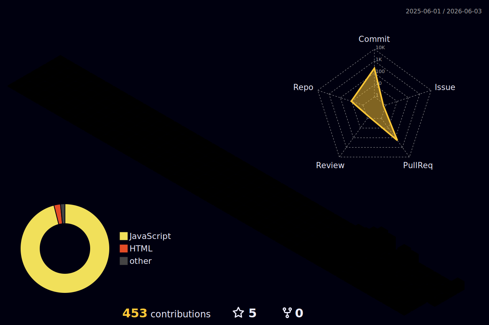

# 👋 Hi, I'm Wilbert

## 🚀 About Me
I'm a **React Native Developer** passionate about building modern, scalable mobile applications with seamless frontend and backend integration.

## 📊 GitHub Stats

## 🛠️ My Tech Stack

### Frontend

### Mobile

### Backend

### Database & Backend Services

### Push Notifications

### Deployment & Hosting

### Tools & Others

## 🏔️ 3D Contribution Graph

  

## 📈 Activity Graph

## 💬 Visitor Counter

